# MiniServe — a miniature LLM inference runtime

**Continuous batching, token-budget scheduling, chunked prefill and block-based KV
management — built from scratch to study what a serving scheduler actually trades
away.**

```text
Python 3.12+   ·   zero runtime dependencies   ·   124 checks, no test framework
5 scheduling policies   ·   3 arrival processes   ·   13 figures, all generated from real runs
```

The engine turns a stream of concurrent generation requests into a sequence of model
forward passes, deciding every step how many compute tokens each request gets and which
physical KV blocks back them. It is a *scheduler and memory-management project*: the
model execution is a stated cost model, and the interesting behaviour is in the
decisions, the memory, and the measurements.

---

## Headline result

One mixed workload — 120 requests, Poisson arrivals at 16/s, prompts 4–512 tokens,
outputs 4–256, a 64-token step budget, 4 concurrent requests, a 256-block KV pool:

```text
Requests:                  120 / 120 finished
Prompt tokens:            11,252
Generated tokens:          7,159
Engine steps:              2,046

Throughput:                845 tok/s
Mean TTFT:                 575 ms          (p50 515 ms, p95 1,200 ms)
Mean TPOT:                 4.02 ms         (ITL p95 6.56 ms)
Mean E2E:                  823 ms          (p95 1,501 ms)
Queue time (mean):         559 ms          ← 97% of mean TTFT is waiting to be scheduled
KV peak utilization:       29.7%           (mean 13.9%, 5.4% internal fragmentation)
Decode batch (mean/max):   3.5 / 4
```

Read the queue-time line first. **Almost all of the latency in a saturated serving
system is queueing, not compute** — which is why the scheduler, not the kernel, is what
these experiments move.

> **What these numbers are.** Modelled time from a stated linear cost function
> (`prefill = 2.0 ms + 0.08·tokens`, `decode = 1.5 ms + 0.05·requests + 0.004·context`),
> not measurements of a GPU. The engine, the scheduler, the KV manager and the metrics
> are real; the execution cost is a model, so the results are reproducible and
> comparative rather than absolute. Everything below is produced by the scripts in this
> repository — see [Reproduce](#reproduce).

---

## Architecture

```text
   Requests ──▶┌─────────────────┐
               │  Request queue  │   burst · Poisson · closed-loop clients
               └────────┬────────┘
                        ▼
               ┌─────────────────┐
               │    Scheduler    │   one decision per step, per request:
               │                 │   "give r3 thirty compute tokens"
               │  token budget   │
               │  continuous     │   SchedulerOutput{ r1:1, r2:1, r3:30 }
               │  chunked prefill│   + evictions + block allocations
               │  preemption     │
               └────────┬────────┘
                        │  the plan is speculative:
          ┌─────────────┴──────────────┐
          ▼                            ▼
  ┌───────────────┐            ┌───────────────┐
  │ KV block      │            │ Model runner  │
  │ manager       │            │               │
  │ block tables  │            │ prefill chunk │
  │ alloc / free  │            │ decode token  │
  │ PagePlan      │            └───────┬───────┘
  └───────┬───────┘                    │
          └─────────────┬──────────────┘
                        ▼
               ┌─────────────────┐
               │     Engine      │   commits state, moves blocks, decides
               └────────┬────────┘   who finished, advances the clock
                        ▼
               ┌─────────────────┐
               │     Metrics     │   TTFT · ITL · TPOT · E2E · queue · throughput · KV
               └─────────────────┘
```

Four rules hold the design together:

1. **One engine step is one model forward pass.** Everything the engine does is
   expressed as work inside a step.
2. **The scheduler speaks token grants, not modes.** It never says "prefill r3"; it says
   "give r3 thirty tokens". A full prefill, a chunked prefill and a decode are then the
   same kind of decision, and the same contract expresses all three.
3. **Planning is speculative.** The scheduler decides against a transactional
   `BlockPlan` and mutates nothing; the engine commits frees and allocations in one
   ordered phase after the runner succeeds. A plan that is abandoned cannot leave
   physical memory moved.
4. **Memory is physical, not a counter.** KV lives in fixed-size blocks with per-request
   block tables, allocated as a sequence grows and freed when it ends — not as
   `used_tokens += 1`.

---

## Quickstart

```bash
git clone <this repo> && cd mini_infer
python -m venv .venv && source .venv/bin/activate
pip install -e .                      # no runtime dependencies

# 124 checks, no test framework: seven scripts of plain asserts
for f in check_engine check_memory check_preemption check_metrics check_benchmark \
         check_policies check_visualizations; do python scripts/$f.py; done

# runnable demos, each showing one idea
python examples/demo.py                # a scheduler timeline and KV occupancy
python examples/kv_pressure.py         # preemption off vs on
python examples/policy_comparison.py   # the five policies, head to head
python examples/benchmark_demo.py      # saturation, KV sweeps, arrival models

# benchmark anything from the CLI
python -m mini_infer.cli --requests 200 --arrival poisson --rate 16
python -m mini_infer.cli --sweep policy --values fcfs,prefill_first,balanced,static
python -m mini_infer.cli --sweep max_batch_tokens --values 16,32,64,128 --export /tmp/r

# regenerate every figure in this README
pip install -e ".[plot]" && python scripts/make_figures.py
```

`TESTING.md` is the hands-on guide: seven experiments with expected output, a reading
order, and the invariants to poke at yourself.

---

## What a run looks like

Four requests, a 32-token step budget, 16-token prefill chunks, a 24-block pool. A
`P<n>` cell is a prefill chunk of *n* tokens for that request; each `D1` is one output
token:

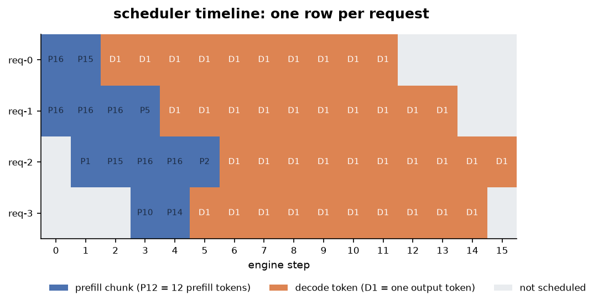

Four properties of the scheduler are visible at once: prefill chunks interleaving with
decode (steps 1–5 admit new requests while others generate), the 32-token budget never
exceeded, requests finishing at different steps and their slots going idle, and a tail
where only one or two requests still generate.

The same run's memory and load. The dashed line is internal fragmentation — reserved
block capacity holding no tokens — which comes and goes as sequences start, cross block
boundaries and finish:

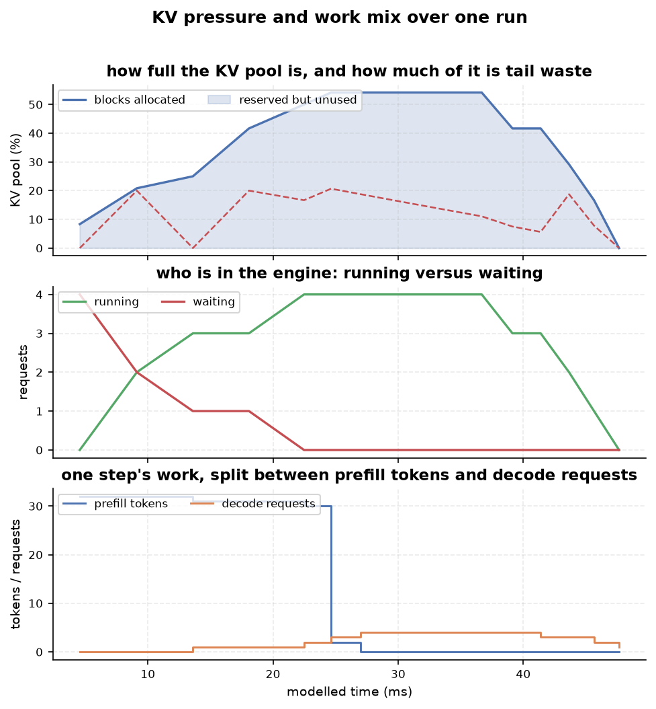

And the latency spread a single run produces, which no mean summarises. This is the
300-request run from Experiment 1's 16 req/s point:

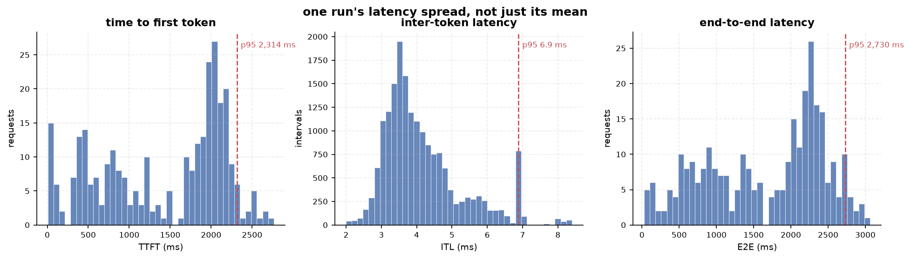

The TTFT histogram is bimodal — a fast cluster that arrived when the engine was idle and
a queueing mode around 2.2 s — while ITL stays in a tight 3–7 ms band. Latency under load
is mostly a story about *when you arrived*, not about how fast tokens are produced.

---

## Experiments

Every figure below is produced by `scripts/make_figures.py`, from a fixed seed, on every
run. Conclusions are what the measurements support — including where they disagree with
the intuition that motivated the experiment.

### 1. Capacity: throughput saturates, latency does not

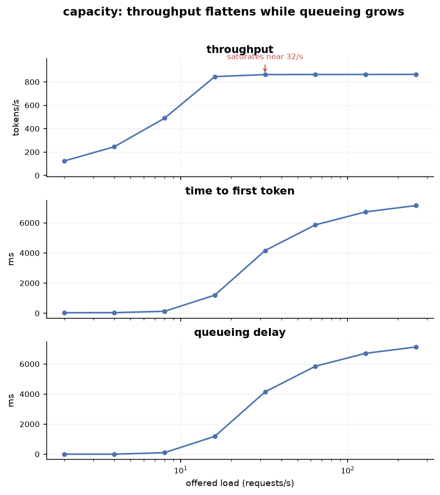

| Offered load | Throughput | Mean TTFT | p95 TTFT | p95 queue |
|---|---|---|---|---|
| 2 req/s | 122.9 tok/s | 13.8 ms | 30.7 ms | 0 ms |
| 4 req/s | 245.4 tok/s | 15.9 ms | 35.4 ms | 0 ms |
| 8 req/s | 489.5 tok/s | 36.3 ms | 126.8 ms | 101.5 ms |
| 16 req/s | 845.1 tok/s | 575.2 ms | 1,200.2 ms | 1,186.8 ms |
| 32 req/s | 862.2 tok/s | 2,176.9 ms | 4,157.3 ms | 4,142.5 ms |
| 64 req/s | 863.3 tok/s | 3,053.7 ms | 5,861.1 ms | 5,846.4 ms |
| 256 req/s | 864.0 tok/s | 3,707.3 ms | 7,141.4 ms | 7,125.5 ms |

**Throughput flattens near 864 tok/s at ~32 req/s, while p95 TTFT grows 233×** (30.7 ms →
7,141 ms). Past saturation, extra offered load is converted into waiting, not into work.
The queue-time column tracking TTFT almost exactly is the evidence: the extra latency is
admission delay, not slower generation.

### 2. Static vs continuous batching

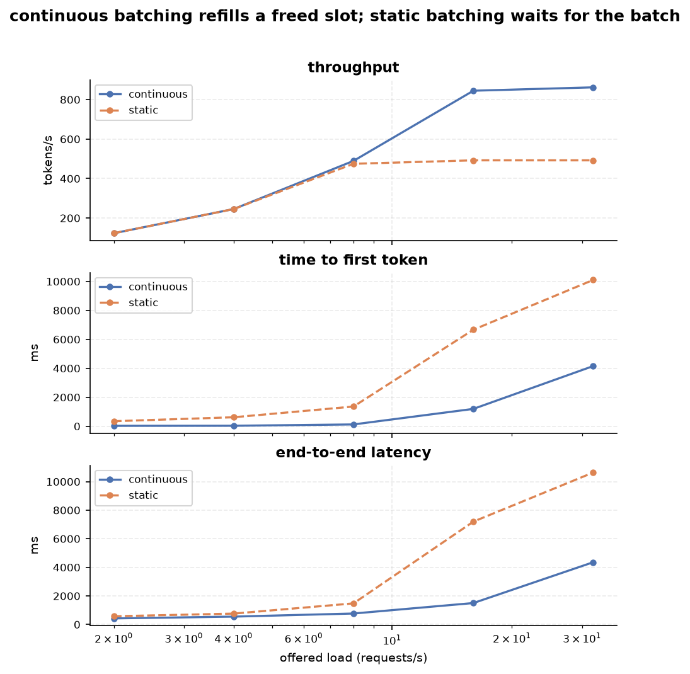

| Offered load | Continuous | Static | | p95 TTFT continuous | p95 TTFT static |
|---|---|---|---|---|---|
| 2 req/s | 122.9 tok/s | 122.9 tok/s | | 30.7 ms | 349.3 ms |
| 4 req/s | 245.4 tok/s | 245.4 tok/s | | 35.4 ms | 622.1 ms |
| 8 req/s | 489.5 tok/s | 474.8 tok/s | | 126.8 ms | 1,362.5 ms |
| 16 req/s | 845.1 tok/s | 492.4 tok/s | | 1,200.2 ms | 6,667.6 ms |
| 32 req/s | 862.2 tok/s | 492.3 tok/s | | 4,157.3 ms | 10,105.0 ms |

Static batching — form a batch, run it to completion, then admit the next — **caps at
492 tok/s and 5.6× worse p95 TTFT** at 16 req/s, because a slot that frees stays idle
until the whole batch drains. Below ~8 req/s the two are identical: the engine is not
saturated, so there is nothing to refill.

A subtlety that matters for honesty: **with homogeneous lengths the two policies produce
*identical* numbers**, because the whole batch finishes on one step and no slot is ever
idle. Static batching is worse *when the batch is heterogeneous* — which the mixed
workload above is, and which real traffic is. `check_policies.py` asserts both the
difference and the identity.

### 3. Chunked prefill

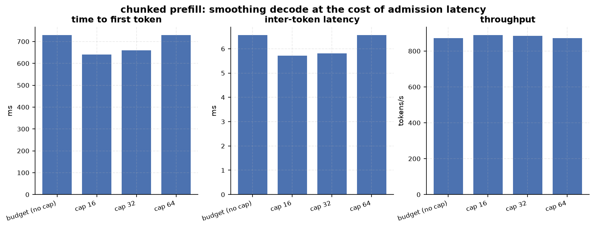

| Prefill policy | Mean TTFT | p95 ITL | Throughput | Largest prefill step |
|---|---|---|---|---|
| No cap (budget-sized chunks) | 729.0 ms | 6.56 ms | 872.9 tok/s | 64 tokens |
| Cap 64 | 729.0 ms | 6.56 ms | 872.9 tok/s | 64 tokens |
| Cap 32 | 660.4 ms | 5.81 ms | 883.9 tok/s | 62 tokens |
| Cap 16 | **640.0 ms** | **5.72 ms** | **888.4 tok/s** | 48 tokens |

Chunking at 16 tokens **improves every aggregate**: mean TTFT −12%, p95 ITL −13%,
throughput +2%. That is not what the textbook trade-off predicts (smaller chunks usually
cost throughput), and the reason is workload-specific: with prompts up to 512 tokens and
a 64-token budget, letting one request consume a whole step holds up admission for
everyone behind it, and the shorter chunks let more requests be admitted per unit time.

Per request, the trade is still there and points the other way for long prompts — the
short request's TTFT improves while the long request's worsens, measured in
`TESTING.md` Experiment 2. **Aggregate curves can hide a real per-request trade-off, so
both are measured.**

### 4. The token budget is not "bigger is better"

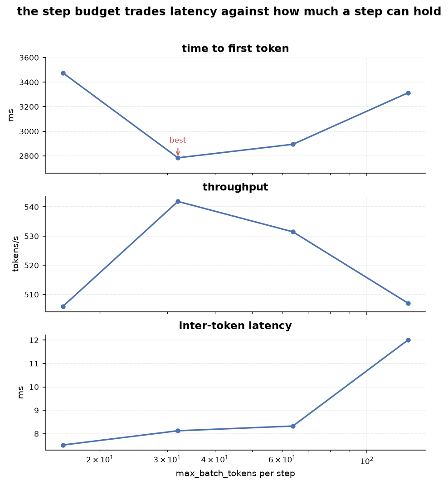

| `max_batch_tokens` | Mean TTFT | p95 TTFT | Mean TPOT | p95 ITL | Throughput |
|---|---|---|---|---|---|
| 16 | 3,475.5 ms | 6,780.8 ms | 5.26 ms | 7.52 ms | 505.9 tok/s |
| **32** | **2,784.0 ms** | **5,551.1 ms** | 6.12 ms | 8.13 ms | **541.9 tok/s** |
| 64 (default) | 2,894.1 ms | 5,794.0 ms | 6.72 ms | 8.33 ms | 531.5 tok/s |
| 128 | 3,312.9 ms | 6,600.2 ms | 7.18 ms | 12.00 ms | 507.1 tok/s |

TTFT is **non-monotonic** in the step budget: 32 tokens/step beats both 16 and 128, and
it is also the throughput peak. A larger budget lets one long prompt monopolise a step
and pushes decodes and short prompts out; a smaller one adds per-step overhead. Note
that the configured default (64) is not the best value for this workload — the table is
what says so.

### 5. KV pressure

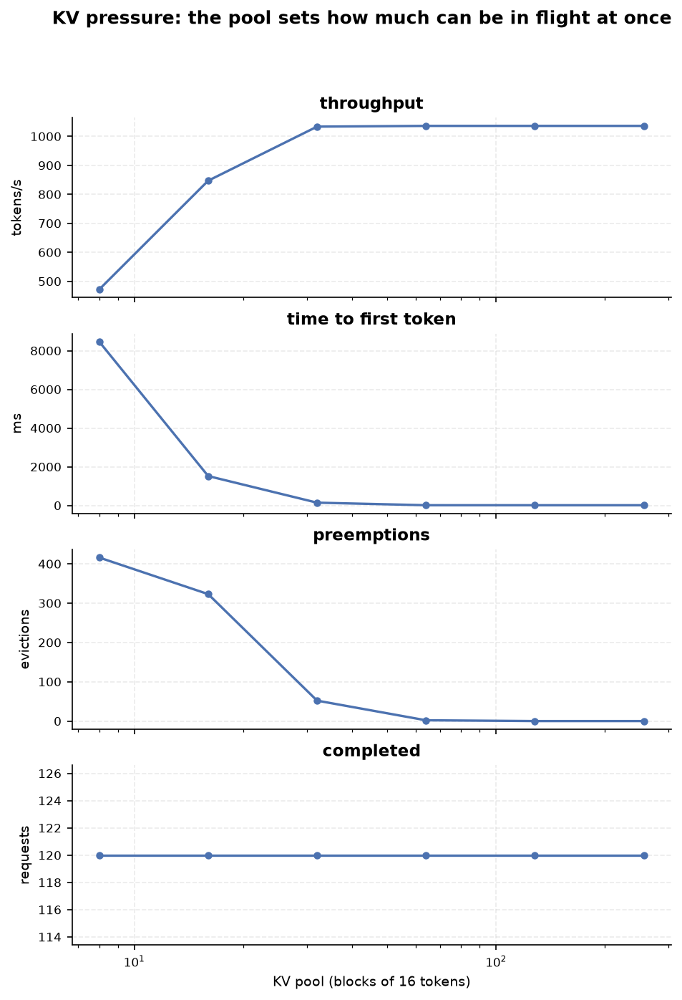

120 requests, 16 concurrency, 48-token prompts, 64-token outputs (≈7 blocks each):

| KV pool | Throughput | p95 TTFT | Evictions | Finished |
|---|---|---|---|---|
| 8 blocks | 472.0 tok/s | 8,461.3 ms | 416 | 120/120 |
| 16 blocks | 847.0 tok/s | 1,519.5 ms | 323 | 120/120 |
| 32 blocks | 1,033.5 tok/s | 144.2 ms | 52 | 120/120 |
| 64 blocks | 1,036.0 tok/s | 12.7 ms | 2 | 120/120 |
| 128 blocks | 1,036.0 tok/s | 11.7 ms | 0 | 120/120 |

**Below the working set, the pool sets the throughput ceiling.** An 8-block pool needs
416 recomputations to finish the same work that a 64-block pool finishes with 2, and
costs 8.5 seconds of p95 TTFT against 13 ms.

The important part is that **completion stays at 120/120 in every configuration**:
recompute preemption converts memory pressure into work and latency rather than into
failed requests. No request is lost, no output token is lost — the victim's generated
tokens are kept and only its prompt is recomputed.

### 6. Block size

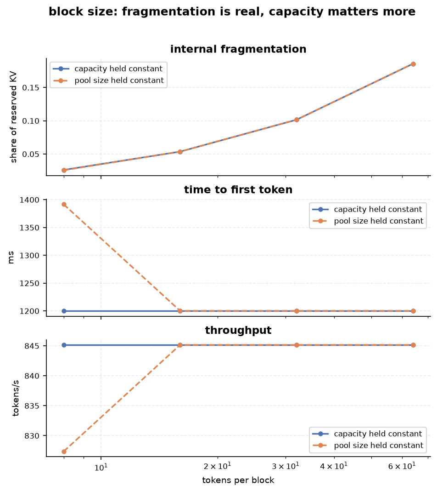

| Tokens per block | Mean fragmentation | Max fragmentation | p95 TTFT | Throughput |
|---|---|---|---|---|
| 8 | 2.6% | 8.9% | 1,200 ms | 845 tok/s |
| 16 (default) | 5.4% | 20.4% | 1,200 ms | 845 tok/s |
| 32 | 10.2% | 29.8% | 1,200 ms | 845 tok/s |
| 64 | 18.6% | 42.2% | 1,200 ms | 845 tok/s |

Internal fragmentation — reserved block capacity holding no tokens — **scales with block
size: 2.6% at 8 tokens to 18.6% at 64**. Latency and throughput do not move at all,
because the cost model charges nothing per block. That is the honest answer to "why
block size 16?": in this runtime it is a memory-efficiency knob, and a real
implementation would price the block-table and gather overhead that makes very small
blocks unattractive.

The figure also shows two ways to sweep block size. Holding the **pool** at 128 blocks
varies capacity as well (1024 → 8192 tokens); holding **capacity** at 2048 tokens does
not. At 8 tokens/block the difference is visible — the pool sweep gets 827 tok/s against
845 — and at 16+ both are above the working set and identical. **A block-size sweep that
fixes the block count is also a capacity sweep**, which is easy to miss.

### 7. Policy comparison

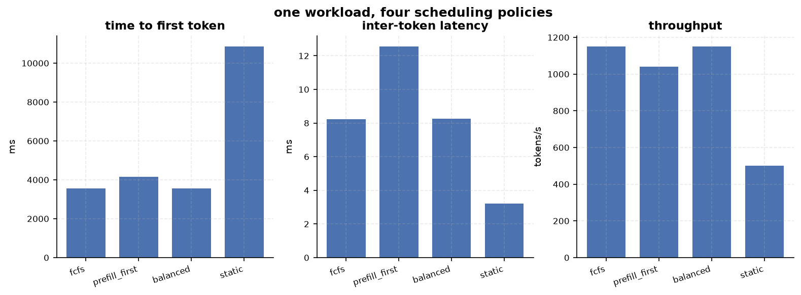

One saturating workload (200 requests, Poisson 64/s), four policies:

| Policy | Throughput | Mean TTFT | p95 TTFT | p95 ITL |
|---|---|---|---|---|
| `fcfs` (= `decode_first`) | 1,150.7 tok/s | 3,549.1 ms | 7,121.8 ms | 8.24 ms |
| `prefill_first` | 1,039.0 tok/s | 4,148.9 ms | 8,231.7 ms | 12.55 ms |
| `balanced` | 1,149.5 tok/s | 3,555.5 ms | 7,138.9 ms | 8.25 ms |
| `static` | 500.8 tok/s | 10,859.4 ms | 21,051.4 ms | 3.20 ms |

Under a saturated queue, `prefill_first` is **worse on every latency metric** — it loses
throughput (1,039 vs 1,151 tok/s), and since TTFT here is dominated by queue depth, the
throughput loss costs more than prefill priority wins back. `balanced` matches `fcfs`
because with only 4–8 decoders its 16-token prefill floor is never binding.

That is a real finding, and it is why the next experiment isolates the mechanism instead
of averaging it away.

### 8. Decode priority is a trade, not a win

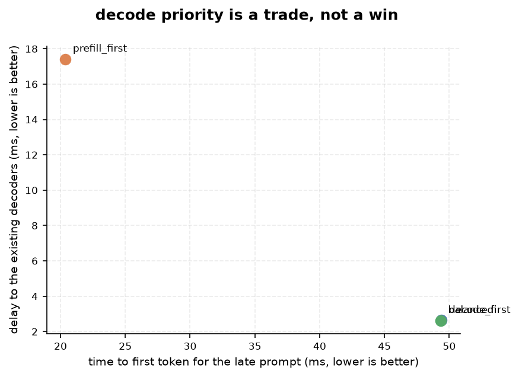

8 requests are decoding and already fill the step when a 64-token prompt arrives:

| Policy | Late prompt's TTFT | Delay to the existing decoders |
|---|---|---|
| `decode_first` | 49.4 ms | 2.6 ms |
| `prefill_first` | **20.4 ms** | **17.4 ms** |
| `balanced` | 49.3 ms | 2.6 ms |
| `static` | not served within 400 steps | 2.0 ms |

**Prefill priority starts the new request 2.4× sooner and makes the requests already in
flight wait 6.7× longer for their next token.** The two policies are not better or worse;
they choose different victims. `static` never serves the late request at all within the
window because no slot frees until its batch drains — that is the static-batching
penalty, seen from one request's point of view.

### 9. Fairness: bounding the worst wait

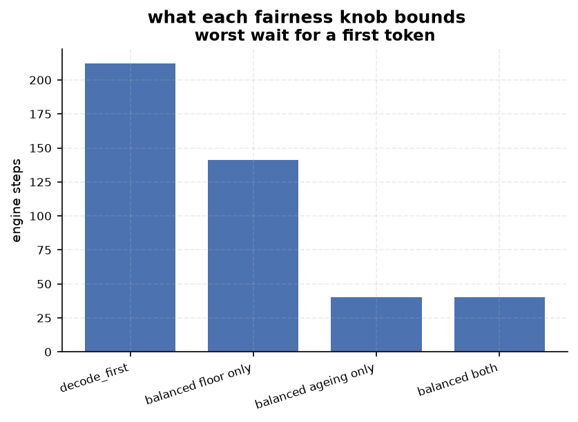

40 requests arrive at once with an 8-token budget and 64 slots, so prefills compete with
a saturated decode batch:

| Configuration | Worst wait for a first token |
|---|---|
| `decode_first` | 212 steps |
| `balanced`, reservation only (2 tokens/step) | 141 steps |
| `balanced`, ageing only (`max_wait_steps=8`) | 40 steps |
| `balanced`, both | 40 steps |

Both knobs help, and each has one job: `prefill_reservation` is a floor the decodes may
not spend, and `max_wait_steps` decides *which* waiter the floor is spent on. Together
they cut the worst wait **5×** with essentially unchanged throughput (2,420 tok/s for
`decode_first`, 2,399–2,485 for the balanced variants).

**A correction to the obvious framing.** It is tempting to say decode-first starves
prefills into never running. In this engine that is false, and the honest version is more
interesting: a prefill can be granted **zero tokens for a step, repeatedly** — that is
real, and it is why the worst wait reaches 212 steps — but every request is eventually
served, because admission is arrival-ordered and every output budget is finite, so the
decode batch always drains. The failure mode is **latency, not deadlock**, and ageing is
what bounds it.

### 10. The arrival process changes what "the same load" measures

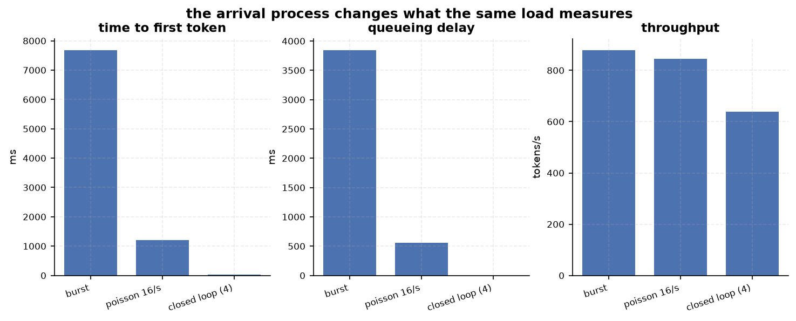

| Arrival model | Throughput | p95 TTFT | Mean queue | p95 ITL |
|---|---|---|---|---|
| Burst (all at t=0) | 879.5 tok/s | 7,687.2 ms | 3,847.8 ms | 6.88 ms |
| Poisson @16/s | 845.1 tok/s | 1,200.2 ms | 559.3 ms | 6.56 ms |
| Closed loop (4 clients) | 639.4 tok/s | 34.9 ms | **0.059 ms** | 4.20 ms |

Closed-loop queue time is essentially zero **by construction** — a client only issues its
next request after its previous one finishes, so the offered load self-limits. That makes
it the right workload for comparing *scheduler behaviour*, while burst measures *capacity*
and Poisson models an open-loop service. Reporting one number without naming the arrival
model is not reporting a result.

---

## How the scheduler works

**One step, one budget.** Every step plans at most `max_batch_tokens` of work, split
between decode tokens (one per decoding request) and prefill chunks. The budget is a hard
ceiling; the chunk cap can only lower a chunk, never raise it. A prompt longer than the
budget is split rather than stalled, because refusing to split would deadlock.

**Two passes, speculative.** The scheduler builds a plan, and if it does not fit the KV
pool it names a victim, marks the eviction *in the plan only*, and rebuilds. The engine
then commits: free the victims' blocks, rewind them, release anyone who finished,
allocate for the work that ran, in that order. Nothing physical moves while planning.

**Preemption by recomputation.** A victim loses its cached prompt (its cursor rewinds to
zero and its block table is cleared) but **keeps every token it generated**. It is
re-admitted later and recomputes its prompt. Victims are chosen youngest-first (LIFO),
and only an older request may evict a younger one, which stops two requests from handing
the pool back and forth.

**Policies are one decision wide.** `fcfs`, `decode_first`, `prefill_first`, `balanced`
and `static` share the budget accounting, the memory planning and the eviction rule;
they differ only in who gets the step, or (for `static`) who is allowed to join a batch.

---

## What is measured

Definitions follow the ones vLLM publishes, so the numbers mean what a serving engineer
expects them to mean:

| Metric | Definition |
|---|---|
| TTFT | arrival → first generated token (includes queueing) |
| ITL | gap between consecutive streamed tokens, reported as a distribution |
| TPOT | `(end_to_end − TTFT) / (output_tokens − 1)`, per request, defined by vLLM's benchmark tooling |
| E2E | arrival → completion |
| Queue time | arrival → first step that ran the request |
| Throughput | generated tokens per second of modelled time |
| KV utilization | allocated blocks / total blocks, sampled per step |
| Internal fragmentation | reserved capacity holding no tokens, sampled per step |
| Decode batch | decoding requests per step |
| Prefill size | prefill tokens per step |

Every aggregate is traceable to the steps and tokens that produced it, and two runs of the
same policy on the same seed produce bit-identical metric rows — `check_policies.py`
asserts it, so a benchmark can never be noise without a test failing.

---

## Limitations

Stated up front, because a runtime project is judged by what it knows it does not do:

| Limitation | Status |
|---|---|
| Execution cost is a stated linear model, not a GPU | deliberate: fast, deterministic, comparative |
| No attention over paged tensors | it is a block manager, not PagedAttention |
| Preemption recomputes; there is no swap path | recompute is cheaper to reason about; swap is future work |
| `fcfs` and `decode_first` are the same schedule | tested and labelled a finding, not hidden |
| No prefix caching | the best next feature: hash full prompt blocks and share them |
| No priority classes or deadlines | ageing is the only fairness mechanism |
| A request that can never fit stalls the run | detected by `can_ever_fit()`; no rejection policy yet |
| Python-only, single process | no tensor/pipeline parallelism, on purpose |

---

## Reproduce

```bash
# headline table
python -m mini_infer.cli --requests 120 --arrival poisson --rate 16

# every figure in this README, from a fixed seed
python scripts/make_figures.py                 # writes figures/*.png

# the full check suite (124 checks)
for f in check_engine check_memory check_preemption check_metrics check_benchmark \
         check_policies check_visualizations; do python scripts/$f.py; done
```

## Repository layout

```text
mini_infer/
  engine/       request model, scheduling contract, policies, the execution loop
  memory/       KV block pool; BlockPlan is a transactional view of it
  runner/       execution-cost model (and the seam for a real model runner)
  metrics/      TTFT / ITL / TPOT / throughput / KV utilization / fragmentation
  benchmark/    arrival processes, workload generation, driver, sweeps, exports
  visualizations/  text timelines and charts, plus the matplotlib figures
scripts/        check_*.py (plain asserts) and make_figures.py
examples/       five runnable demos, each showing one idea
figures/        generated by scripts/make_figures.py, committed for the README
```

**Reading order for the core logic** (≈250 lines):
`engine/request.py` → `engine/scheduler.py` → `engine/policies.py` → `engine/engine.py`
→ `memory/block_manager.py`.

## Where this goes next

1. **A real model runner** (`RunnerConfig` → `TorchModelRunner`): greedy decode over real
   KV tensors, which turns the block manager from bookkeeping into memory that a model
   actually attends over.
2. **Prefix caching**: hash full prompt blocks and share them between requests with a
   common prefix — the highest-value feature still missing.
3. **Swap-based preemption**: copy a victim's blocks to host memory instead of recomputing,
   and measure which wins as a function of prompt length.

---

*Every number in this README came from a run on this machine. `TESTING.md` is the
companion hands-on guide: how to run each experiment, what to expect, which invariants to
poke at, and how to read the code.*
