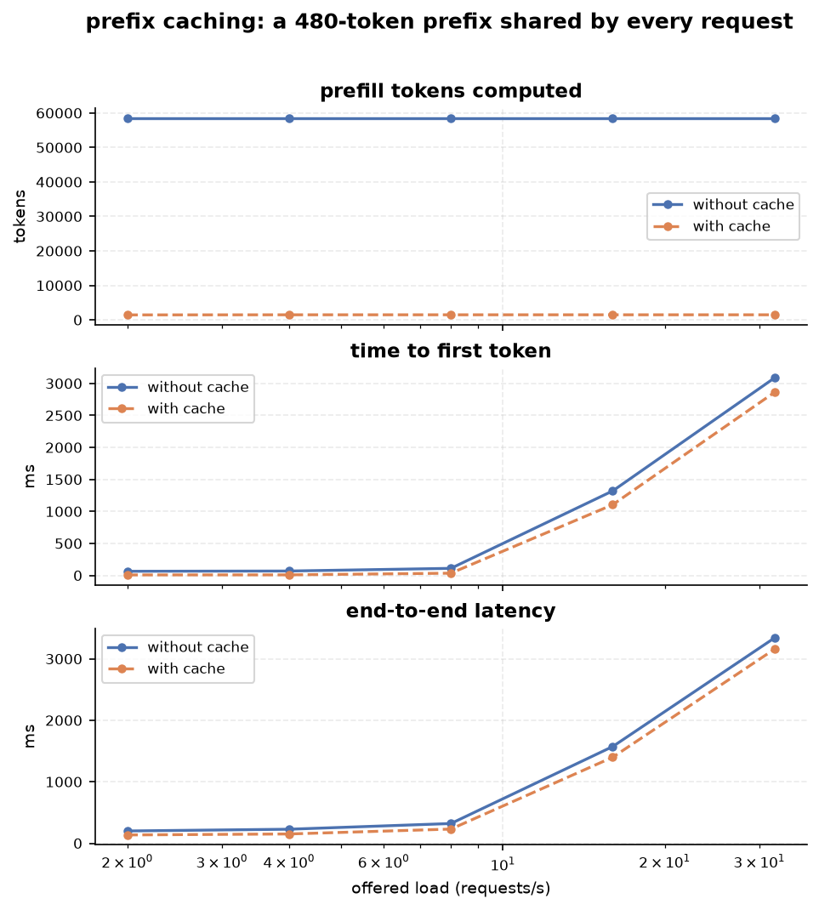

# MiniServe: an LLM serving runtime

**A compact runtime for understanding how scheduling and KV memory interact during LLM inference.**

```text
continuous batching · token-budget scheduling · chunked prefill · recompute preemption
block-based KV management · content-addressed prefix caching · real Llama-family execution
```

```text
Python 3.12+   ·   dependency-free core   ·   optional PyTorch runner
155 checks   ·   5 policy configurations   ·   3 arrival processes   ·   14 reproducible figures
```

MiniServe turns concurrent generation requests into scheduled model-execution steps. On every engine step it decides which requests run, how many tokens each request computes, and which physical KV blocks back those tokens.

Large workload sweeps use a deterministic execution-cost model so scheduler behavior can be compared reproducibly. The same scheduler, engine, and block manager also drive a real Llama-family runner whose attention reads and writes the runtime's physical KV pool.

The focus is the serving control plane: scheduling, admission, KV-memory management, preemption, prefix reuse, and the latency/throughput trade-offs between them.

---

## What is implemented

| Area | MiniServe |
|---|---|
| Scheduling | continuous batching, static batching, token budgets, chunked prefill, decode/prefill policies, fairness controls |
| KV memory | fixed-size physical blocks, per-request block tables, fragmentation tracking, recompute preemption |
| Prefix reuse | content-addressed full-block caching, chained hashes, shared/refcounted blocks, evictable cached blocks |
| Workloads | burst, Poisson open-loop, closed-loop concurrency |
| Metrics | TTFT, ITL, TPOT, E2E, queue time, throughput, KV utilization, fragmentation |
| Execution | deterministic simulated runner + real Llama-family runner over block-managed KV tensors |
| Validation | 155 checks; real-model logits and greedy tokens compared against Hugging Face |

---

## Key results

These are the three results I would look at first:

| Result | Measurement |
|---|---|
| **Prefix reuse** | 58,560 → **1,472** computed prefill tokens on a 120-request shared-prefix workload, a **97% reduction** |
| **Real-model correctness** | max logit difference **6e-08** in float32 and **5.6e-17** in float64 vs `AutoModelForCausalLM`; identical greedy tokens in tested cases |
| **Continuous vs static batching** | at 16 req/s in the deterministic cost model: **845 vs 492 tok/s** and **1.2 s vs 6.7 s p95 TTFT** |

The throughput and latency results in the simulator are **comparative results under the stated cost model, not GPU benchmark numbers**. Real-model validation is reported separately below.

---

## Architecture

```text
   Requests ──▶┌─────────────────┐
               │  Request queue  │   burst · Poisson · closed-loop clients
               └────────┬────────┘
                        ▼
               ┌─────────────────┐
               │    Scheduler    │   one decision per step, per request:
               │                 │   "give r3 thirty compute tokens"
               │  token budget   │
               │  continuous     │   SchedulerOutput{ r1:1, r2:1, r3:30 }
               │  chunked prefill│   + evictions + block allocations
               │  preemption     │
               └────────┬────────┘
                        │  speculative plan
          ┌─────────────┴──────────────┐
          ▼                            ▼
  ┌───────────────┐            ┌───────────────┐
  │ KV block      │            │ Model runner  │
  │ manager       │            │               │
  │ block tables  │            │ prefill chunk │
  │ alloc / free  │            │ decode token  │
  │ BlockPlan     │            └───────┬───────┘
  └───────┬───────┘                    │
          └─────────────┬──────────────┘
                        ▼
               ┌─────────────────┐
               │     Engine      │   commits state, advances the clock,
               └────────┬────────┘   releases and allocates KV
                        ▼
               ┌─────────────────┐
               │     Metrics     │   TTFT · ITL · TPOT · E2E · queue · throughput · KV
               └─────────────────┘
```

Four rules hold the design together:

1. **One engine step is one model forward pass.**
2. **The scheduler speaks token grants, not modes.** It says "give r3 thirty tokens", rather than "prefill r3". Full prefill, chunked prefill, recomputation and decode use the same scheduling contract.
3. **Planning is speculative.** The scheduler works against a transactional `BlockPlan`; abandoned plans do not mutate physical memory.
4. **Memory is physical, not a counter.** KV lives in fixed-size blocks with per-request logical-to-physical block tables.

---

## Quickstart

```bash
git clone https://github.com/awesome-pro/miniserve.git
cd miniserve
python -m venv .venv && source .venv/bin/activate
pip install -e .

# core checks
for f in check_engine check_memory check_preemption check_metrics check_benchmark \
         check_policies check_prefix_cache check_visualizations check_torch_runner; do
  python scripts/$f.py
done

# real model through the same scheduler + KV manager
pip install -e ".[torch]"
python examples/real_model.py --model HuggingFaceTB/SmolLM2-135M-Instruct

# focused demos
python examples/demo.py
python examples/kv_pressure.py
python examples/policy_comparison.py
python examples/benchmark_demo.py
python examples/prefix_cache.py

# benchmark from the CLI
python -m miniserve.cli --requests 200 --arrival poisson --rate 16
python -m miniserve.cli --sweep policy --values fcfs,prefill_first,balanced,static
python -m miniserve.cli --sweep max_batch_tokens --values 16,32,64,128 --export /tmp/r
python -m miniserve.cli --prefix-cache --requests 120 --rate 12

# regenerate every figure
pip install -e ".[plot]"
python scripts/make_figures.py
```

`TESTING.md` is the hands-on guide: experiments, expected output, invariants, and a reading order through the core runtime.

---

## A real model in the same runtime

The benchmark suite uses a deterministic cost model so thousands of scheduling experiments can run quickly and reproducibly. Separately, the same scheduler, block manager, request state, and engine can execute a real Llama-family transformer.

```bash
pip install -e ".[torch]"
python examples/real_model.py \
  --model HuggingFaceTB/SmolLM2-135M-Instruct \
  --prompt "Explain continuous batching in one sentence:" \
  --max-new-tokens 24
```

KV is stored as:

```text
[layers, physical_blocks, kv_heads, block_size, head_dim]
```

A request's logical block `i` maps to a physical block through its block table. During a step, MiniServe writes new keys and values into those physical blocks, gathers each request's cached context through its block table, and uses a block-diagonal causal mask so requests cannot attend to one another.

This is **block-managed KV storage**, not a fused PagedAttention kernel. The runner gathers blocks into contiguous tensors before attention, which is correct but intentionally not optimized.

I compare the custom forward against Hugging Face rather than trusting generated text alone:

| Check | Result |
|---|---|
| Logits vs `AutoModelForCausalLM` | max difference **6e-08** in float32 |
| Same check in float64 | max difference **5.6e-17** |
| Greedy tokens vs `model.generate` | identical |
| Chunked prefill, `block_size=1`, batching, preemption | identical tokens in tested cases |

For the tested cases, the float64 path matches the reference to machine precision.

A real forward samples the next token while computing the positions it was granted. The sampled token therefore extends the logical sequence before its own KV position has been computed; the next engine step computes that pending position. This is why MiniServe tracks **logical sequence length** separately from **`num_computed_tokens`**.

---

## What a run looks like

Four requests, a 32-token step budget, 16-token prefill chunks, and a 24-block KV pool:


`P<n>` is a prefill/recompute chunk of `n` tokens; `D1` is one decode token. Prefill chunks interleave with decode, the step budget is never exceeded, and slots are reused as requests finish.

The same run's KV occupancy:


The dashed line is internal fragmentation: reserved block capacity that does not currently hold sequence tokens.

A latency distribution from the 16 req/s point of the capacity experiment:


In this workload the TTFT distribution is bimodal: some requests arrive when capacity is available, while others wait behind a saturated queue. ITL remains much tighter than TTFT.

---

## Experiments

All figures are regenerated by `scripts/make_figures.py` from fixed seeds. Unless a section explicitly says otherwise, `tok/s` and latency values below use the deterministic execution-cost model:

```text
prefill = 2.0 ms + 0.08 · tokens
decode  = 1.5 ms + 0.05 · requests + 0.004 · context
```

The scheduler, KV manager, request state, metrics, and workload generation are real implementations; modeled time makes the experiments deterministic and comparative.

### 1. Capacity: throughput saturates, latency does not


| Offered load | Throughput | Mean TTFT | p95 TTFT | p95 queue |
|---|---:|---:|---:|---:|
| 2 req/s | 122.9 tok/s | 13.8 ms | 30.7 ms | 0 ms |
| 4 req/s | 245.4 tok/s | 15.9 ms | 35.4 ms | 0 ms |
| 8 req/s | 489.5 tok/s | 36.3 ms | 126.8 ms | 101.5 ms |
| 16 req/s | 845.1 tok/s | 575.2 ms | 1,200.2 ms | 1,186.8 ms |
| 32 req/s | 862.2 tok/s | 2,176.9 ms | 4,157.3 ms | 4,142.5 ms |
| 64 req/s | 863.3 tok/s | 3,053.7 ms | 5,861.1 ms | 5,846.4 ms |
| 256 req/s | 864.0 tok/s | 3,707.3 ms | 7,141.4 ms | 7,125.5 ms |

Throughput flattens near 864 tok/s while p95 TTFT keeps growing. Past saturation, additional offered load mostly becomes queueing rather than additional completed work.

### 2. Static vs continuous batching


| Offered load | Continuous | Static | p95 TTFT continuous | p95 TTFT static |
|---|---:|---:|---:|---:|
| 2 req/s | 122.9 tok/s | 122.9 tok/s | 30.7 ms | 349.3 ms |
| 4 req/s | 245.4 tok/s | 245.4 tok/s | 35.4 ms | 622.1 ms |
| 8 req/s | 489.5 tok/s | 474.8 tok/s | 126.8 ms | 1,362.5 ms |
| 16 req/s | 845.1 tok/s | 492.4 tok/s | 1,200.2 ms | 6,667.6 ms |
| 32 req/s | 862.2 tok/s | 492.3 tok/s | 4,157.3 ms | 10,105.0 ms |

Static batching forms a batch and drains it before admitting another. With heterogeneous sequence lengths, freed slots remain idle until the whole batch finishes. At 16 req/s continuous batching reaches 845 tok/s versus 492 tok/s for static batching, with 5.6× lower p95 TTFT in this workload.

### 3. Chunked prefill


| Prefill policy | Mean TTFT | p95 ITL | Throughput | Largest prefill step |
|---|---:|---:|---:|---:|
| No cap (budget-sized chunks) | 729.0 ms | 6.56 ms | 872.9 tok/s | 64 tokens |
| Cap 64 | 729.0 ms | 6.56 ms | 872.9 tok/s | 64 tokens |
| Cap 32 | 660.4 ms | 5.81 ms | 883.9 tok/s | 62 tokens |
| Cap 16 | **640.0 ms** | **5.72 ms** | **888.4 tok/s** | 48 tokens |

In this mixed workload a 16-token chunk cap improves mean TTFT by 12%, p95 ITL by 13%, and throughput by 2%. The reason is workload-specific: smaller prefill chunks leave room for admission and decode work that otherwise waits behind a long prompt. Per-request trade-offs still differ for long and short requests.

### 4. The token budget is not "bigger is better"


| `max_batch_tokens` | Mean TTFT | p95 TTFT | Mean TPOT | p95 ITL | Throughput |
|---|---:|---:|---:|---:|---:|
| 16 | 3,475.5 ms | 6,780.8 ms | 5.26 ms | 7.52 ms | 505.9 tok/s |
| **32** | **2,784.0 ms** | **5,551.1 ms** | 6.12 ms | 8.13 ms | **541.9 tok/s** |
| 64 | 2,894.1 ms | 5,794.0 ms | 6.72 ms | 8.33 ms | 531.5 tok/s |
| 128 | 3,312.9 ms | 6,600.2 ms | 7.18 ms | 12.00 ms | 507.1 tok/s |

TTFT is non-monotonic in the step budget. For this workload, 32 tokens/step outperforms both 16 and 128 because very small budgets underutilize each step while very large budgets let long prefills dominate a step.

### 5. KV pressure and recompute preemption


120 requests, 16 concurrency, 48-token prompts, 64-token outputs:

| KV pool | Throughput | p95 TTFT | Evictions | Finished |
|---|---:|---:|---:|---:|
| 8 blocks | 461.5 tok/s | 8,714.1 ms | 822 | 120/120 |
| 16 blocks | 831.5 tok/s | 1,744.2 ms | 554 | 120/120 |
| 32 blocks | 1,033.7 tok/s | 143.9 ms | 68 | 120/120 |
| 64 blocks | 1,036.0 tok/s | 11.7 ms | 1 | 120/120 |
| 128 blocks | 1,036.0 tok/s | 11.7 ms | 0 | 120/120 |

Below the working set, KV capacity becomes the bottleneck. Recompute preemption keeps all 120 requests completable, but insufficient memory is converted into repeated work and latency.

A preempted request keeps its **logical sequence**, including tokens it already generated, but loses its KV state. `num_computed_tokens` rewinds to zero and the existing sequence is recomputed before generation resumes.

### 6. Block size and fragmentation


| Tokens per block | Mean fragmentation | Max fragmentation | p95 TTFT | Throughput |
|---|---:|---:|---:|---:|
| 8 | 2.6% | 8.9% | 1,200 ms | 845 tok/s |
| 16 | 5.4% | 20.4% | 1,200 ms | 845 tok/s |
| 32 | 10.2% | 29.8% | 1,200 ms | 845 tok/s |
| 64 | 18.6% | 42.2% | 1,200 ms | 845 tok/s |

Internal fragmentation increases with block size. Latency and throughput do not move in this model because the cost function does not charge for block-table or gather overhead. A production implementation would introduce a countervailing cost for making blocks too small.

The experiment also separates **fixed block count** from **fixed token capacity**. Holding block count constant accidentally changes total KV capacity as block size changes, so a block-size sweep can otherwise become a capacity sweep without making that explicit.

### 7. Policy comparison


One saturated workload, 200 requests at Poisson 64/s:

| Policy | Throughput | Mean TTFT | p95 TTFT | p95 ITL |
|---|---:|---:|---:|---:|
| `fcfs` (= `decode_first`) | 1,150.7 tok/s | 3,549.1 ms | 7,121.8 ms | 8.24 ms |
| `prefill_first` | 1,039.0 tok/s | 4,148.9 ms | 8,231.7 ms | 12.55 ms |
| `balanced` | 1,149.5 tok/s | 3,555.5 ms | 7,138.9 ms | 8.25 ms |
| `static` | 500.8 tok/s | 10,859.4 ms | 21,051.4 ms | 3.20 ms |

Under this saturated queue, `prefill_first` loses throughput and therefore also worsens queue-dominated TTFT. `balanced` matches `fcfs` here because its prefill reservation rarely binds; the next experiment isolates the policy trade-off directly.

### 8. Prefill against decode priority


Eight requests are already decoding when a 64-token prompt arrives:

| Policy | Late prompt TTFT | Delay to existing decoders |
|---|---:|---:|
| `decode_first` | 49.4 ms | 2.6 ms |
| `prefill_first` | **20.4 ms** | **17.4 ms** |
| `balanced` | 49.3 ms | 2.6 ms |
| `static` | not served within 400 steps | 2.0 ms |

Prefill priority starts the late request 2.4× sooner but makes already-decoding requests wait 6.7× longer for their next token. The policies optimize different victims.

### 9. Fairness: bounding the worst wait


| Configuration | Worst wait for a first token |
|---|---:|
| `decode_first` | 212 steps |
| `balanced`, reservation only | 141 steps |
| `balanced`, ageing only (`max_wait_steps=8`) | 40 steps |
| `balanced`, both | 40 steps |

`prefill_reservation` guarantees some prefill budget; ageing decides which waiting request should receive it. In this workload ageing bounds the worst wait from 212 to 40 steps while leaving throughput essentially unchanged.

### 10. Arrival process changes what "the same load" means


| Arrival model | Throughput | p95 TTFT | Mean queue | p95 ITL |
|---|---:|---:|---:|---:|
| Burst | 879.5 tok/s | 7,687.2 ms | 3,847.8 ms | 6.88 ms |
| Poisson @16/s | 845.1 tok/s | 1,200.2 ms | 559.3 ms | 6.56 ms |
| Closed loop (4 clients) | 639.4 tok/s | 34.9 ms | **0.059 ms** | 4.20 ms |

Closed-loop traffic self-limits: a client sends its next request only after the previous one completes, so queue time is nearly zero by construction. Burst, Poisson open-loop, and closed-loop traffic answer different performance questions; the arrival model is part of the benchmark result.

### 11. Prefix caching: compute once, reuse the KV



120 requests, each with a 480-token shared prefix and an 8-token unique tail:

| Offered load | Prefill tokens off → on | Mean TTFT off → on | Mean E2E off → on | Throughput off → on |
|---|---:|---:|---:|---:|
| 2 req/s | 58,560 → **1,440** | 64.3 → **7.3 ms** | 199.6 → 134.9 ms | 65.8 → 65.9 tok/s |
| 4 req/s | 58,560 → **1,472** | 68.4 → **8.3 ms** | 227.9 → 150.8 ms | 131.2 → 131.5 tok/s |
| 8 req/s | 58,560 → **1,472** | 110.0 → **34.5 ms** | 320.5 → 230.1 ms | 261.0 → 261.9 tok/s |
| 16 req/s | 58,560 → **1,472** | 1,319.6 → 1,104.1 ms | 1,572.4 → 1,398.5 ms | 389.1 → **403.3 tok/s** |
| 32 req/s | 58,560 → **1,472** | 3,084.8 → 2,859.6 ms | 3,339.1 → 3,156.2 ms | 389.4 → **404.4 tok/s** |

The shared prefix is computed once instead of once per request, reducing computed prefill work by 97%. At low offered load that translates directly into lower TTFT; once the engine is saturated, queueing dominates more of the benefit.

Only **full blocks** are cached. Cached blocks are immutable, reference-counted, and content-addressed using the block contents plus the previous block hash, so a block is reused only as part of the same preceding prefix. This matters because positional information is already baked into KV.

Prefix attachment is also part of scheduler planning. The scheduler reduces the request's remaining work and memory requirement before deciding admission, so cache hits do not bypass KV-pressure or preemption logic.

Requests scheduled concurrently **before** a matching prefix has been materialized cannot share it; staggered admission therefore produces more reuse. Cached blocks also continue to occupy the KV pool, although unowned cached blocks are evictable.

---

## How the scheduler works

**One step, one budget.** Every step plans at most `max_batch_tokens` of work, split between decode tokens and prefill/recompute chunks. Prompts larger than the budget are chunked rather than stalled.

**Planning is speculative.** The scheduler builds a `BlockPlan`. If the planned work does not fit, it can name a preemption victim and replan without mutating the actual pool. The engine commits the final plan.

**Preemption is recomputation.** A victim keeps its logical sequence, including generated tokens, but loses all KV state. Its computation cursor rewinds to zero, and the existing sequence is recomputed when it is admitted again. Victims are selected youngest-first and only an older request may evict a younger one, preventing two requests from repeatedly handing the pool back and forth.

**Cached prefixes participate in admission.** A cache hit changes both how much compute remains and how many additional blocks are required. The scheduler plans the attachment before committing it.

**Policies change who gets the budget, not the accounting.** `fcfs`, `decode_first`, `prefill_first`, `balanced`, and `static` share the same token-budget and memory-planning machinery.

---

## Metrics

Definitions follow common LLM-serving usage:

| Metric | Definition |
|---|---|
| TTFT | arrival → first generated token, including queueing |
| ITL | gap between consecutive streamed tokens |
| TPOT | `(E2E - TTFT) / (output_tokens - 1)` per request |
| E2E | arrival → completion |
| Queue time | arrival → first scheduled execution |
| Throughput | generated tokens per second of benchmark time |
| KV utilization | allocated blocks / total blocks, sampled per step |
| Internal fragmentation | allocated block capacity not occupied by sequence tokens |
| Decode batch | decoding requests per step |
| Prefill size | prefill/recompute tokens per step |

For simulated runs, "benchmark time" is the deterministic cost model. For the real runner, wall-clock time is measured separately.

---

## Limitations

| Limitation | Status |
|---|---|
| Large benchmark sweeps use a linear execution-cost model | deliberate: fast, deterministic, comparative; not GPU performance |
| No fused paged-attention kernel | real runner gathers blocks into contiguous tensors; correct, not optimized |
| Real runner targets small Llama-family models | no CUDA kernel work, tensor parallelism, or distributed execution |
| Preemption recomputes | no CPU/NVMe KV swap path |
| `fcfs` and `decode_first` produce the same schedule | tested and kept as explicit policy aliases |
| Prefix cache stores full blocks only | avoids copy-on-write on a shared partial tail block |
| Concurrent requests cannot reuse a prefix before it is materialized | no "compute once, wait" mechanism yet |
| Cached blocks still consume KV capacity | unowned cached blocks are evictable |
| No priority classes or deadlines | ageing is the fairness mechanism |
| Oversized requests are detected but not rejected through a serving API | no production admission/rejection layer |
| Python-only, single process | intentionally a compact inference-runtime project, not a production serving stack |

---

## Repository layout

```text
miniserve/
  engine/          request state, scheduling contract, policies, execution loop
  memory/          KV block pool and speculative BlockPlan
  runner/          deterministic cost model + real PyTorch/Llama runner
  metrics/         TTFT / ITL / TPOT / throughput / KV utilization / fragmentation
  benchmark/       arrivals, workload generation, driver, sweeps, exports
  visualizations/  timelines, charts, figure helpers
scripts/           checks and figure generation
examples/          focused runnable demos
figures/           generated benchmark figures used in this README
```

**Suggested reading order:**

```text
engine/request.py
→ engine/scheduler.py
→ engine/policies.py
→ engine/engine.py
→ memory/block_manager.py
→ runner/torch_runner.py
```

---

## Reproduce

```bash
# benchmark snapshot
python -m miniserve.cli --requests 120 --arrival poisson --rate 16

# regenerate figures
python scripts/make_figures.py

# full check suite
for f in check_engine check_memory check_preemption check_metrics check_benchmark \
         check_policies check_prefix_cache check_visualizations check_torch_runner; do
  python scripts/$f.py
done

# prefix cache comparison
python examples/prefix_cache.py --requests 120 --rate 12
python -m miniserve.cli --sweep prefix_cache --values off,on --requests 120 --rate 12

# real runner over block-managed KV, checked against Hugging Face
python examples/real_model.py --concurrency 3
python scripts/check_torch_runner.py
```

---

## Where this could go next

1. **Compute-once prefix admission:** let concurrent requests wait on an in-flight shared prefix instead of recomputing it independently.
2. **Swap-based preemption:** compare recomputation against moving KV blocks to host memory as prompt length and memory pressure change.
3. **Fused block-aware attention:** remove the gather step and have the attention kernel consume the block table directly.

---

Every simulator figure is reproducible from the repository's fixed-seed benchmark scripts. `TESTING.md` is the companion hands-on guide for reproducing experiments, inspecting invariants, and reading the implementation.
